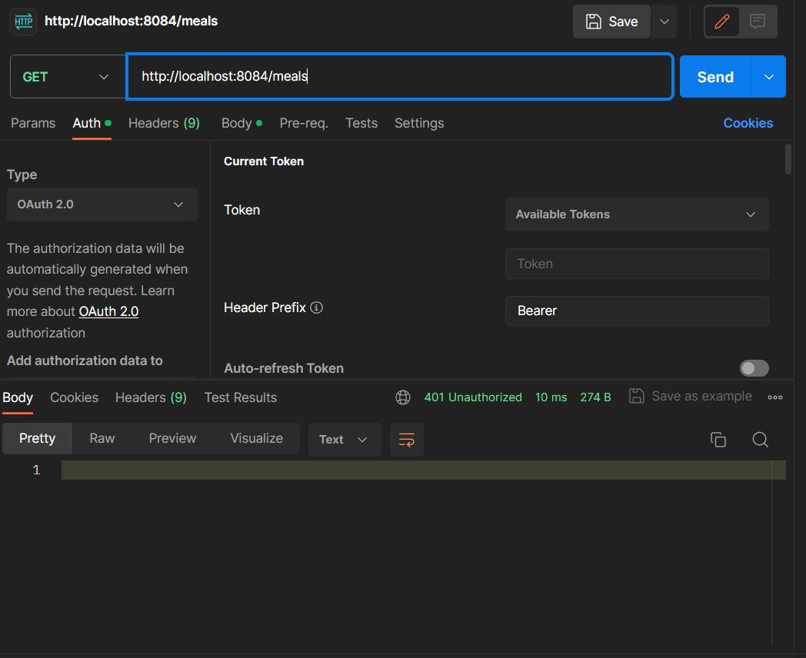
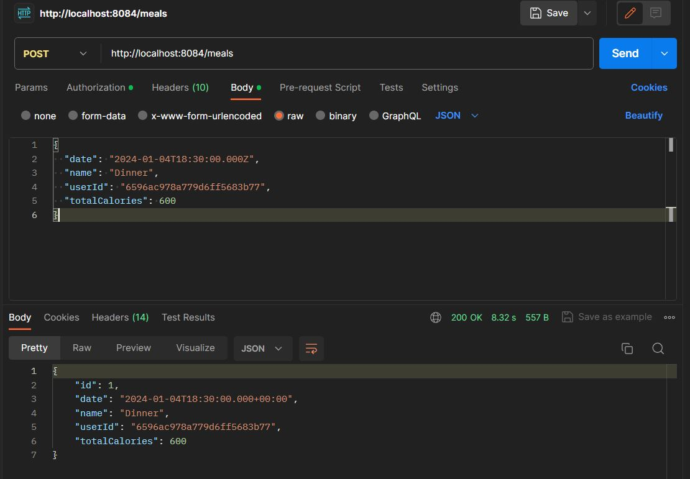
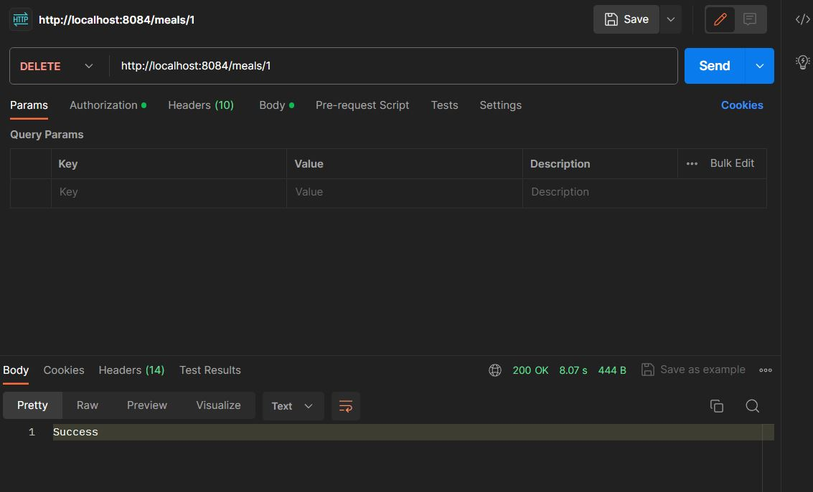

# EDE Project Yarin 

Table Of Content
1. Description of the project
2. Databases
3. Microservices
4. API Gateway (+ Rate Limiting & Security)
5. Endpoints
6. Conclusion


## Descriptipn
I have made this project by myself. Which only required a minimum of 3 Microservices. 
For the theme of this project I went with a fitness/health themed project. I have 3 microservices which I will explain more in depth below.
The three microservices I have are the "Nutrition Service", which allows you to track your meals. Then I have a "Workout Plan Service", which
allows you to track your workouts. To finish of, I've got a "User Service", which deals with users, for example passwords, emails, workout goals, etc.

## Databases
For the databases for each Microservice, I went with 2x MongoDB, and 1x MySQL. The reason for this is, most of our classes use relational databases for
exercises, and I wanted to try this out. Another reason for going twice with MongoDB is, I did my first service with it, and it went easy without any problems,
so I figured I would use this again for another service.

The services that run on MongoDB are the WorkoutPlanService, and the UserService. The NutritionService runs on MySQL.

## Microservices

In this section of the documentation I will be describing each microservice in dept. 

### Workout Plan Service (MongoDB)
This service goes over all the Workout planning. Users can create their own workouts, etc.
The model. For this service, I have 1 Model (Workout), and 2 DTO's (WorkoutRequest & WorkoutResponse)
The @Document annotation defines what the collection will be called where these workouts will be stored.
```java
@Document(collection = "workouts")
@Data
@Builder
@NoArgsConstructor
@AllArgsConstructor
public class Workout {

    private String id, name, userId;
    private Date date;
    private int minutes;
    private boolean isCardioWorkout;
}
```
Below is a list of all the endpoints available in this service, they will be explained more in dept with proof of working more down below in the "Endpoints" sections.
```
GET - /api/workout/{id}
GET - /api/workout/all
GET - /api/workout/user?userId=<userId>
POST - /api/workout
PUT - /api/workout/{id}
DELETE - /api/workout/{id}
```

### Nutrition Service (MySQL)
The purpose of this service is to track your nutrition habbits, this can be done by creating Meals. 
In this service I have 1 model (Meal), and 2 DTOs (MealRequest & MealResponse).
These Meal objects are stored in a table named "nutrition", as you can see by the @Table annotation. 
```java
@Entity
@Table(name = "nutrition")
@Data
@AllArgsConstructor
@NoArgsConstructor
@Builder
public class Meal {

    @Id
    @GeneratedValue(strategy = GenerationType.IDENTITY)
    private Long id;
    private Date date;
    private String name, userId;
    private int totalCalories;

}
```
Below is a list of all the endpoints available in this service, they will be explained more in dept with proof of working more down below in the "Endpoints" sections.
```
GET - /api/meal/all
GET - /api/meal/{id}
GET - /api/meal/user?userId=<userId>
POST - /api/meal
PUT - /api/meal/{id}
DELETE -/api/meal/{id}
```

### User Service (MongoDB)
The user service is a place where Users can be managed, users have workout goals, names, emails and passwords. 
This service again has 1 model (User) and 2 DTOs (UserRequest & UserResponse).
These documents are each stored in a collection named "users".
```java
@Document(collection = "users")
@Data
@Builder
@NoArgsConstructor
@AllArgsConstructor
public class User {

    private String id, name, password, email;
    // goal of hitting an x amount of workouts per week
    private int workoutGoal;
}
```
Below is a list of all the endpoints available in this service, they will be explained more in dept with proof of working more down below in the "Endpoints" sections.
```
GET - /api/user/all
GET - /api/user/{id}
POST - /api/user
PUT - /api/user/{id}
DELETE - /api/user/{id}
```

## API Gateway
In this section I will be explaining more about the API gateway specifics of my project. 
This includes rate limiting, security and the gateway re-routing itself.
The API gateway is meant to re-route all of the services endpoints to a more centralized endpoint.
For example, my individual services have the endpoints

```
GET - /api/user/all
GET - /api/meal/all
```
The gateway will allow you to re-route those endpoints and configure them to work like this
```
GET - /users/all
GET - /meals/all
```
This looks overall cleaner, and allows you to secure endpoints in a central place as well.

I added **every** endpoint in all of my services to the API Gateway.

### Security
For the security of my endpoints I used OAuth2. For this I had to configure a SecurityWebFilterChain. 
In that configuration I went ahead and forced on everything that is not with prefix /public.
I also had to make some adjustments to the application.yml for this.

### Rate Limiting
The rate limiting has been configured by the Redis rate limiting.
For this I had to create a new docker container running on the port 6379. Then I had to configure a "RedisStandaloneConfiguration", which I had to pass along into a "LettuceConnectionFactory"
and then to finish off the redis configuration, I've had to create a template and set the factory.

## Endpoints
In this section I will be describing each endpoint (as configured in the API gateway), with proof of the working of it.
All of these endpoints also require authorization, this is what happens if you are not authorized and try to make a request.


And this is the result if you are authorized


**For these endpoints I will be creating a user first, this userid will be used throughout the entirety of this section the deletion of the user will be the very last endpoint I showcase!**

### User Endpoints
These are all endpoints that are rerouted from the UserService in the API gateway
#### (POST) (Authorized) http://localhost:8084/users
This endpoint deals with the creation of a new user.
Request Body
```json
{
  "name": "John Doe",
  "password": "password123",
  "email": "john@example.com",
  "workoutGoal": 5
}
```


#### (GET) (Authorized) http://localhost:8084/users
This endpoint returns a list of all users.


#### (GET) (Authorized) http://localhost:8084/users/{id}
This endpoint returns a user based of the ID passed in as path variable.


#### (PUT) (Authorized) http://localhost:8084/users/{id}
This endpoint allows the editing of a user, in this example we are going to edit
the name to "James Doe", and the workout goal to "25".


Now I will do another get request by id (same as bove), to display it has actually updated.


### Nutrition Endpoints
These are all endpoints that are rerouted from the NutritionService in the API gateway

#### (POST) (Authorized) http://localhost:8084/meals
This endpoint deals with the creation of a new meal.
Request Body
```json
   {
  "date": "2024-01-04T18:30:00.000Z",
  "name": "Dinner",
  "userId": "6596ac978a779d6ff5683b77",
  "totalCalories": 600
}
```

#### (GET) (Authorized) http://localhost:8084/meals
This endpoint returns a List of all meals


#### (PUT) (Authorized) http://localhost:8084/meals/{id}
This endpoint allows you to update a meal with a given ID.
For this test we're going to change the name to "Lunch", and the totalCalories to "450"


### (GET) (Authorized) http://localhost:8084/meals/{id}
This endpoint allows you to get a specific meal by adding an ID in as Path Variable.
This will also prove that the previous PUT request has worked.


#### (GET) (Authorized) http://localhost:8084/meals?userId=6596ac978a779d6ff5683b77
This endpoint allows you to get all the meals that have the userID of the Request Parameter you fill in (userId)


#### (DELETE) (Authorized) http://localhost:8084/meals/{id}
This endpoint allows you to delete a meal by passing in a meal id as a path variable.


To verify that this has worked, I will be calling the endpoint (GET - http://localhost:8084/meals) again, to return all meals.

As you see, now it returns an empty list.

### Workout Endpoints
These are all endpoints that are rerouted from the WorkoutPlanService in the API gateway

#### (POST) (Authorized) http://localhost:8084/workouts
This endpoint allows you to create a new workout
Request Body
```json
{
  "name": "Morning Jog",
  "userId": "6596ac978a779d6ff5683b77",
  "date": "2024-01-04T06:00:00.000Z",
  "minutes": 30,
  "isCardioWorkout": true
}
```
Below I will send an HTTP request to prove that this has in fact worked.


#### (GET) (Authorized) http://localhost:8084/workouts
This endpoint allows you to request all workouts available.


#### (PUT) (Authorized) http://localhost:8084/workouts/{id}
This endpoint allows you to edit an existing workout of the ID you passed in as Path Variable.
The ID in this example will be the same ID as the workout we created above (6596bf1a02c4de33ca6ecc47)
In this example we're going to update the name to "Evening Lift", and set "isCardioWorkout" to false.


Below I will do an HTTP request by this ID to show that it has in fact worked.

#### (GET) (Authorized) http://localhost:8084/workouts/{id}
This endpoint allows you to get a workout based of a specific ID passed in as a PathVariable.
In this example we use the ID of the workout we edited above (6596bf1a02c4de33ca6ecc47)


#### (GET) (Authorized) http://localhost:8084/workouts?userId=6596ac978a779d6ff5683b77
This endpoint allows you to get a list of workouts from a specific userid. This userid is passed in
as a Request Parameter.


#### (DELETE) (Authorized) http://localhost:8084/workouts/{id}
This endpoint allows you to delete a workout. 


To show that this worked, I will now show a list of all workouts by doing (GET - http://localhost:8084/workouts)

0
#### (DELETE) (Authorized) (http://localhost:8084/user/{id})
This is the endpoint that allows you to delete a user, we will now delete the user we have been using 
throughout this entire Endpoint Documentation.


And now if we request all users by calling the endpoint (GET - http://localhost:8084/users)
we see that that user has in fact been deleted.


## Conclusion
This project has been by far one of the most interesting projects I've ever had provided by school. I'm not a fan of Docker and I had almost no experience with it,
but afer this project I feel very confident in the use of docker and docker compose. Besides that, I learned how to make multiple microservices, and have them work together and be linked together through an API gateway.

This project was really fun to work on, and I've learned a lot about microservices as well.
